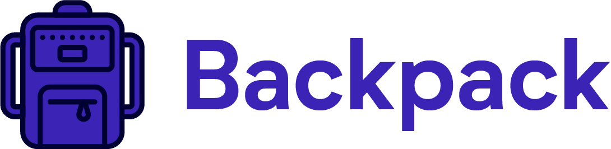

  

<h3 align="center">
  A beautiful desktop application for academic organization and control
</h3>

  
  
  

  <a href="#features">Features</a>&nbsp;&nbsp;&nbsp;|&nbsp;&nbsp;&nbsp;
  <a href="#getting-started">Getting started</a>&nbsp;&nbsp;&nbsp;|&nbsp;&nbsp;&nbsp;
  <a href="#contributing">Contributing</a>&nbsp;&nbsp;&nbsp;|&nbsp;&nbsp;&nbsp;
  <a href="#license">License</a>

## Features

This app features all the features to improve your academic experience. Like these:

- **Timetable** — A timetable for you to register your classes
- **Taks** — A to-do list so you don't forget to do
- **Notebooks** — Notebooks for you to make your own personalized notes

## Getting started

1. Clone this repo using `git clone https://github.com/greysonmrx/Backpack.git`
2. Move yourself to the appropriate directory: `cd backpack` 
3. Run `yarn` to install dependencies 
4. Run `yarn dev` to start the app

## Contributing

Please read [CONTRIBUTING.md](CONTRIBUTING.md) for details on our code of conduct, and the process for submitting pull requests.

## License

This project is licensed under the MIT License - see the [LICENSE.md](license.md) file for details.

Made with :hearts: by Greyson :wave:
